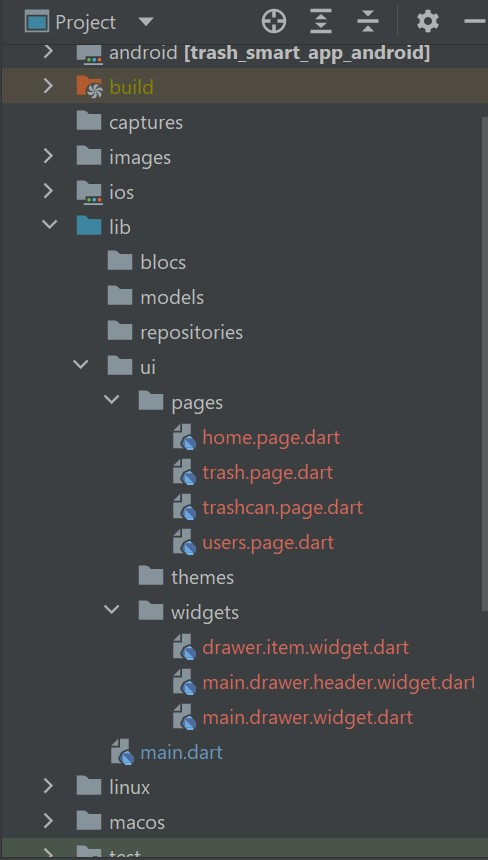

<h3>Compte Rendu</h3>

Voici une explication du déroulement de l'application
1) Création de la page principale Home Page :
  - Classe RootView 
  - Page home.page.dart
2)Création d’un Menu 
- Widget main.drawer.dart pour la classe MainDrawer contenant le menu, le profile et la liste des styles.
- Widget main.drawer.header.dart pour la classe MainDrawerHeader qui contient le profile
  - Widget drawer.item.dart pour la classe DrawerItem qui contient la liste des styles
3) Création des  pages :
   - UsersPage, TrashcanPage, TrashPage :
Une application mobile dont le menu est bien paramétré, un DrawerHeader qui est séparé, les éléments du menu qui sont séparés dans des widgets, le menu lui-même se trouve dans un tableau, dans le MainHeader, ce qui permettra d’ajouter facilement un nouveau menu.
4) Création de  thèmes avec Bloc :
  -  Fichier themes.dart
  - Ajout de dépendances Bloc et Flutter_Bloc
  - Création des fichiers theme.event.dart, theme.state.dart, theme.bloc.dart,
  - Dans le fichier RootView : 
- ajout de themeBloc et themeState dans BlocBuilder
- Ajout de ThemeData dans MaterialApp
  -Dans le fichier main : 
- Ajout de MultiBlocProvider pour construire les BlocProviders, ThemeBloc etc.

# trash_smart_app

Une application qui permet la gestion des boubelles connectées

## Getting Started

This project is a starting point for a Flutter application.

A few resources to get you started if this is your first Flutter project:

- [Lab: Write your first Flutter app](https://docs.flutter.dev/get-started/codelab)
- [Cookbook: Useful Flutter samples](https://docs.flutter.dev/cookbook)

For help getting started with Flutter development, view the
[online documentation](https://docs.flutter.dev/), which offers tutorials,
samples, guidance on mobile development, and a full API reference.

