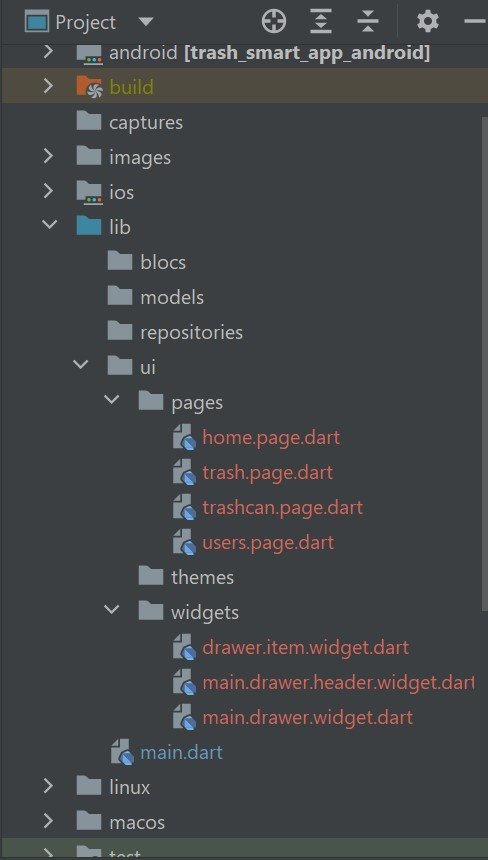

# TrashSmart - Application Mobile Éco-Citoyenne

Application mobile Flutter développée dans le cadre du cursus Expert en Informatique et Système d'Information. TrashSmart permet aux citoyens de suivre leur impact écologique, de localiser des poubelles connectées et de gérer leurs points de récompense.

---

## 📊 Compte Rendu & Architecture Visuelle



### 1. Architecture des Pages & Navigation
* **Page Principale (Home) :** Implémentation basée sur la classe globale `RootView` associée à la page `home.page.dart`.
* **Menu Latéral Évolutif (Drawer) :** Conception hautement modulaire pour faciliter l'ajout ultérieur de nouvelles fonctionnalités :
    * `main.drawer.dart` (`MainDrawer`) : Gestionnaire principal du menu contenant le profil utilisateur et l'accès aux différents styles.
    * `main.drawer.header.dart` (`MainDrawerHeader`) : Composant isolé dédié à l'affichage du profil de l'utilisateur connecté.
    * `drawer.item.dart` (`DrawerItemWidget`) : Widget générique pour l'affichage unitaire des éléments du menu, stockés dynamiquement dans un tableau (Array).
* **Modules Métiers :** Déploiement des vues fonctionnelles `UsersPage`, `TrashcanPage` et `TrashPage`.

### 2. Gestion d'État Globale (Theming avec BLoC)
L'application intègre une architecture réactive pour la gestion dynamique des thèmes graphiques :
* **Dépendances :** Utilisation des packages officiels `bloc` et `flutter_bloc`.
* **Composants BLoC :** Structuration en trois fichiers piliers : `theme.event.dart`, `theme.state.dart` et `theme.bloc.dart`.
* **Injection & Initialisation :** Configuration du `MultiBlocProvider` à la racine de l'application dans le fichier `main.dart` pour instancier et propager le `ThemeBloc`.
* **Consommation :** Intégration d'un `BlocBuilder` dans la classe `RootView` pour reconstruire dynamiquement la `MaterialApp` avec le `ThemeData` mis à jour.

---

## 🛠️ Stack Technique Avancée

* **Framework :** Flutter & Dart (Cible Android / iOS).
* **Sécurité :** Authentification par jeton JWT (Rôles `USER` / `ADMIN`) stocké localement via `Flutter Secure Storage`.
* **Réseau (Ops) :** Client HTTP `Dio` avec intercepteurs personnalisés pour injecter automatiquement le header `Authorization: Bearer <token>`.
* **Configuration IP :** Connexion au serveur local Spring Boot via l'alias réseau Android `http://10.0.2.2:8081/api`.

---

## 🚀 Getting Started

### Prérequis
* Flutter SDK (Version stable)
* Émulateur Android (SDK gphone x86) ou appareil physique de test
* Backend Spring Boot actif sur le port `8081`

### Installation
```bash
# Récupération des dépendances
flutter pub get

# Lancement de l'application en mode debug
flutter run

📚 Ressources Utiles Flutter
Lab: Write your first Flutter app

Cookbook: Useful Flutter samples

Documentation officielle Flutter